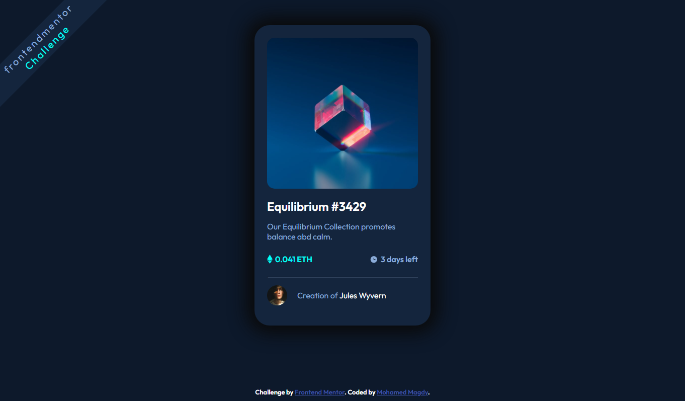

# Frontend Mentor - NFT preview card component solution

This is a solution to the [NFT preview card component challenge on Frontend Mentor](https://www.frontendmentor.io/challenges/nft-preview-card-component-SbdUL_w0U). Frontend Mentor challenges help you improve your coding skills by building realistic projects. 

## Table of contents

- [Overview](#overview)
  - [The challenge](#the-challenge)
  - [Screenshot](#screenshot)
  - [Links](#links)
- [My process](#my-process)
  - [Built with](#built-with)
- [Author](#author)

## Overview

### The challenge

Users should be able to:

- View the optimal layout depending on their device's screen size
- See hover states for interactive elements

### Screenshot

### Links

- Solution URL: [Github](https://github.com/moamed018/NFT-preview-card-component-challenge-hub)
- Frontend Mentor URL: [Frontend Mentor](https://www.frontendmentor.io/solutions/nft-preview-card-component-challenge-hub-DYFOeB02a)
- Live Site URL: [Github Pages](https://moamed018.github.io/NFT-preview-card-component-challenge-hub/)

## My process

### Built with

- Semantic HTML5 markup
- CSS custom properties
- Flexbox

## Author

- Mohamed Madgy
- Frontend Mentor - [@moamed018](https://www.frontendmentor.io/profile/moamed018)
- Twitter - [@mmagdy_01612](https://twitter.com/mmagdy_01612)

